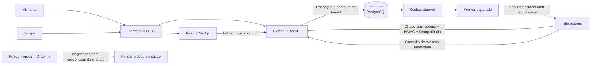

# Arquitetura do FAT Tech CRM Pro

Snapshot de engenharia: 2026-09-11. Descreve o código da nova aplicação e distingue contratos já implementados de componentes ainda a validar. A união funcional completa está em [discovery/requirements.md](discovery/requirements.md) e [discovery/repositories.md](discovery/repositories.md). A existência de uma rota, tela ou container não comprova homologação do fluxo em produção.

## Decisão de estrutura

O produto é um monorepo com uma aplicação React/Next.js em TypeScript e uma API Python/FastAPI. A API concentra identidade, autorização e transações. PostgreSQL é obrigatório em produção; SQLite serve ao desenvolvimento/testes locais. Um worker separado consome a outbox durável para um destino n8n configurado pelo operador. Os conectores de canais e a execução paga de IA permanecem desativados enquanto não houver implementação, configuração e validação.

Essa estrutura evita distribuir uma única transação comercial entre microserviços. n8n recebe/produz eventos por um contrato autenticado; não possui acesso direto às tabelas do CRM. Ruflo, Ponytail e Graphify são ferramentas de engenharia, com dados locais separados do banco de clientes. HeroUI é a biblioteca visual da aplicação, não sua camada de autorização.

O desenho mostra fronteiras; a saída tracejada do worker só é usada quando há destino configurado. Nenhuma seta implica envio ativo para WhatsApp, Instagram, e-mail, Google ou provedor de IA. Receber o evento no n8n não comprova execução de efeitos no fornecedor final.

## Diretórios e responsabilidades

| Caminho | Responsabilidade |
|---|---|
| `apps/web/app/` | Rotas públicas, blog/LPs, login, área `/crm`, metadados, sitemap e robots |
| `apps/web/components/` | Layout, formulários, sessão, dashboard e componentes CRM |
| `apps/web/lib/api.ts` | Cliente HTTP com cookie de sessão e token CSRF; interpretação de erro |
| `apps/web/lib/resources.ts` | Metadados de campos, rótulos, listas e formulários; devem corresponder ao schema Python |
| `apps/web/content/` | Conteúdo público transformado da referência FAT Tech |
| `apps/api/fattech/main.py` | Registro concreto de rotas, sessões, captação, dashboard, integrações e ações especiais |
| `apps/api/fattech/schemas.py` | Validação de entrada, tipos de recurso e estados permitidos |
| `apps/api/fattech/services.py` | CRUD, referências, concorrência, auditoria/outbox e simulação de DAG |
| `apps/api/fattech/security.py` | Argon2, sessões, chaves com escopo, papéis, CSRF e rate limit |
| `apps/api/fattech/db.py` | Engine, sessões SQLAlchemy e contexto Postgres por transação |
| `apps/api/fattech/models.py` | Modelo físico persistente, índices e unicidade |
| `apps/api/fattech/migrate.py` | Schema inicial 0001, papel runtime, grants e RLS PostgreSQL |
| `apps/api/fattech/seed.py` | Bootstrap explícito do proprietário e exemplos somente em desenvolvimento com `--demo` |
| `apps/api/fattech/worker.py` | Claim da outbox, entrega n8n assinada, leases, retries e fila de falhas |
| `infra/` | Imagens, Compose isolado, provisionamento, deploy, ingresso e backup |
| `scripts/` | Desenvolvimento, inventário de arquivos e verificação de padrões de credenciais |
| `docs/` | Arquitetura, domínio, operação, proveniência e requisitos |
| `.local/references/` | Clones e exportações locais; excluídos do Git e da distribuição |
| `graphify-out/` | Grafo de conhecimento derivado; saída local descartável/reconstruível |

## Stack declarada

As versões abaixo vêm dos manifests locais, não de uma afirmação de superioridade ou suporte eterno. O lockfile e o inventário de dependências determinam o artefato instalado.

| Camada | Declaração atual |
|---|---|
| Runtime web | Node.js 24; TypeScript; Next.js 16.3.4; React 19.3.0 |
| Interface | HeroUI React/Styles 3.2.5; Tailwind CSS 4; Lucide; Inter local |
| Runtime API | Python 3.12–3.14; imagem Python 3.12 |
| API/dados | FastAPI 0.135.2; Pydantic 2.12.5; SQLAlchemy 2.0.48; psycopg 3.3.3 |
| Senhas | Argon2-cffi 25.1.0 |
| Banco de produção | PostgreSQL 17, rede e volume dedicados |
| Validação prevista | pytest, Ruff, TypeScript, build Next.js e Playwright |

Não há Redis, Kafka, ClickHouse, banco vetorial ou Kubernetes na implantação atual. Sua presença nos legados não justifica adicioná-los sem um fluxo que os use e evidência de necessidade.

## Identidade, tenancy e autorização

O login verifica senha Argon2 e conta ativa, gera um segredo aleatório de sessão e persiste apenas seu SHA-256. O navegador recebe cookie HttpOnly, SameSite=Lax e Secure em produção. O logout revoga a sessão no banco. Requisições de escrita com cookie validam origem permitida ou token CSRF; autenticação Bearer usa chave de API de escopo explícito, expiração e revogação.

O principal autenticado fornece `tenant_id`, ator e papel. O cliente não escolhe o tenant da mutação. Papéis atuais: `owner`, `admin`, `member`, `viewer`; viewer não escreve. Gestão de equipe, chaves, auditoria e decisões possui restrições adicionais. Chaves de API não recebem autoridade administrativa só por pertencerem ao proprietário.

O modelo atual vincula cada usuário a um tenant e torna e-mail globalmente único. Vínculos de um usuário com várias organizações, troca de tenant e visão consolidada de unidades são requisitos futuros, não consequências automáticas de haver `tenant_id`.

Os serviços filtram registros por tenant, tipo e exclusão lógica. `db.py` configura `fattech.tenant_id` com escopo local à transação e reaplica o contexto após novo início. A inicialização de produção recusa papel superusuário/BYPASSRLS e exige migration `0001`. `migrate.py` habilita e força RLS em `records`, `audit_log`, `event_outbox` e `idempotency_keys`, usando contexto em `USING` e `WITH CHECK`; o runtime não pode alterar/apagar auditoria nem escrever no diretório de tenants. Essas políticas precisam ser aplicadas e comprovadas com dois tenants reais. `users`, `login_sessions` e `api_keys` são usadas antes da resolução de tenant e não têm RLS nessa migration: dependem da autorização da aplicação, com um limite de isolamento diferente das tabelas comerciais.

## Fluxos implementados no código

### Site para CRM

O site renderiza páginas públicas e envia o formulário para `POST /api/v1/public/leads`. A API exige consentimento explícito, valida os campos, contabiliza rate limit e resolve o tenant pelo slug configurado no servidor. Cria um contato, registra atribuição UTM e instante do consentimento, auditoria e evento transacional, devolvendo `202 accepted`.

No snapshot auditado, esse caminho **não** cria automaticamente oportunidade/tarefa, não deduplica por e-mail/telefone e não possui chave idempotente de formulário. Esses comportamentos continuam nos requisitos WEB-03/CRM-03. A resposta de aceite representa persistência do cadastro; não representa entrega de mensagem ou reunião marcada.

### Operação interna

Quatorze recursos têm rotas concretas de listagem, detalhe, criação, alteração e exclusão lógica. Schemas rejeitam campos desconhecidos. Referências para contato, empresa, oportunidade, projeto, conversa e responsável são validadas no tenant. Alterações e exclusões exigem `version`; escrita concorrente obsoleta retorna 409. Cada mutação gera auditoria e outbox na mesma sessão/commit.

O dashboard usa agregações SQL sobre registros persistidos: contatos, oportunidades, pipeline, tarefas, conversas, aprovações e lançamentos pagos. Receita nesse dashboard é soma de lançamentos internos marcados `paid`; não é conciliação bancária ou receita fiscal verificada. `active_automations` é zero porque a execução real não está ativa.

### n8n e eventos

`POST /api/v1/webhooks/n8n` requer chave Bearer com `webhooks:write`, `Idempotency-Key`, timestamp e HMAC-SHA256 de `timestamp + '.' + corpo bruto`. A janela de aceitação é ±300 segundos; `hops` fica entre zero e cinco. O mesmo tenant/chave/corpo retorna a resposta armazenada; corpo diferente retorna 409. Evento, idempotência e auditoria são commitados juntos.

`GET /api/v1/events` permite leitura com `events:read`. A ingestão aceita um envelope de evento; não interpreta automaticamente qualquer evento externo como comando autorizado para alterar contato ou enviar mensagem. `worker.py` entrega eventos a `FATTECH_N8N_OUTBOUND_URL` com HMAC, ID idempotente estável e Bearer opcional. O claim é commitado antes da rede; lease de 90 segundos recupera processamento interrompido; confirmação exige o mesmo token. Falhas transitórias retornam à fila com espera exponencial e limite de tentativas; falhas permanentes esgotadas terminam em `dead_letter`. Sem destino configurado, eventos ficam pendentes.

O transporte n8n é **pelo menos uma vez**: timeout de rede pode repetir o mesmo ID. O consumidor precisa persistir deduplicação antes de efeitos e propagar esse contrato aos fornecedores. Isso é diferente de reenviar cegamente uma mensagem ao cliente. Não há, neste snapshot, workflow n8n homologado nem prova de entrega de saída a um n8n real. Implementação de assinatura/claim no código não equivale a homologação do destino.

### Automação e governança

O grafo de automação é persistido com nós/arestas, rejeita IDs duplicados, referências inexistentes e ciclos. A simulação percorre nós, avalia comparação, altera contexto e apresenta mensagens; IA/webhook externos aparecem bloqueados. Delay não é espera durável nessa simulação. Execução agendada/versionada real ainda não está ligada.

Solicitações G1–G6 guardam intenção, solicitante e expiração de 24 horas. Intenções não aceitam edição por CRUD. A decisão recusa autoaprovação e aplica papel exigido pelo gate. Aprovar registra `execution_status=not_executed`: não existe autorização implícita para executar uma ação externa arbitrária.

Agentes são cadastros pausados A0/A1, com orçamento declarado. O endpoint de execução recusa orçamento insuficiente e retorna indisponível sem runtime. Esse controle não substitui um Budget Guard com reserva atômica, ledger e reconciliação de custo, necessário antes de qualquer chamada paga.

## Estado honesto das capacidades

| Área | Código presente | Limite atual |
|---|---|---|
| Site, login e CRM | Rotas React/Next e endpoints autenticados | Homologação visual e E2E deve ser registrada após execução |
| CRM operacional | Contatos, empresas, oportunidades, tarefas, projetos, produtos e lançamentos | Sem todas as regras de ERP, propostas, agenda, importação/merge e verticais dos legados |
| Atendimento | Conversas e rascunhos de mensagens | Sem ingestão de canal ou envio real homologado |
| Campanhas | Organização de rascunhos e orçamento | Sem disparo, execução agendada ou métricas de provedor |
| Automação | Persistência de DAG e simulador | Sem executor de jornadas duráveis/ativas |
| Integrações | API keys, HMAC, replay e consulta de eventos | Sem conectores Meta/Google/pagamento ligados nem workflow n8n em produção |
| Conhecimento | Documento com conteúdo, categoria, tags e origem | Sem upload/chunks/embeddings/RAG com ACL completo |
| Governança | Registro de agentes e decisão de aprovação | Sem turno de IA, orçamento reservado ou execução vinculada ao gate |
| Operação | Contratos Docker, backup e ingresso | Deploy, restore e isolamento no host Oracle exigem prova atual |

## Hospedagem e recuperação

O Compose define rede `fattechcrmpro-network`, volume `fattechcrmpro-postgres` e portas loopback 4320/4321. PostgreSQL não publica porta no host. Web/API/worker usam limites de recurso e containers sem privilégios; o ingresso HTTPS deve sobrescrever cabeçalhos encaminhados antes que a API confie no IP.

O servidor Oracle é compartilhado. A nova stack deve ser inventariada e testada sem substituir ingress, redes ou volumes do legado. Segredos são gerados no servidor, fora do repositório, com permissões restritas. O deploy aplica migration e bootstrap explícitos antes de liberar tráfego. O backup gera dump custom e SHA-256; restauração em banco descartável, tempo observado e cópia externa completam a prova de recuperação. Instruções operacionais: [OPERATIONS.md](OPERATIONS.md).

## Evidência e liberação

Esta revisão verificou fontes e contratos; **não executou a suíte, build, deploy ou restore**. Resultados de validação devem registrar comando, ambiente, data e resultado real em documento de entrega/validação. Não transportar contagens de testes dos legados.

Critérios pendentes que devem ser comprovados: login inválido/expirado/logout; papéis e chaves revogadas; dois tenants com queries SQL diretas e API; referências cruzadas recusadas; concorrência de versão; transação/auditoria/outbox em rollback; replay HMAC e colisão concorrente de idempotência; captação repetida; schema e frontend concordantes; restauração do banco; worker reiniciado sem perda; navegação mobile/teclado; URLs antigas sem perda de conteúdo. Envio real, IA paga e troca de domínio ficam condicionados aos respectivos contratos implementados e evidências, não a uma alegação de backend “inquebrável”.
