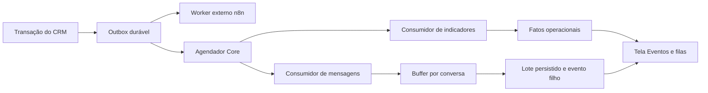

# Core-Engine integrado ao FATTechCRMPro

Data: 2026-09-21. Fonte: export “Core-Engine Knowledge And Function Export”, fornecido pelo usuário em 2026-09-20. Este documento descreve código local; não comprova publicação no Oracle.

## Decisão de integração

O export foi usado como referência de contratos e comportamento, e não como código pronto. O CRM mantém a autenticação, as permissões, o isolamento por organização e sua outbox transacional. A execução interna usa PostgreSQL em produção, com SQLite nos testes locais. Redis Streams e ClickHouse **não foram instalados nesta rodada**. Acrescentar esses serviços exige adaptadores e validação operacional próprios; não há ganho comprovado que justifique substituir a fila durável já existente nesta entrega.

O resultado implementado é um núcleo de consumidores internos independente da entrega externa ao n8n. O worker do n8n mantém o corpo, a assinatura e o significado de `event_outbox.status`. Processar internamente um evento não o marca como entregue a um provedor externo.

## Entregas e regras

- Envelope v1 em `fattech/events.py`: identificadores UUID, organização, ator, instante UTC, dados, trace e hops. Eventos atuais de dois segmentos continuam válidos. Traces históricos não UUID recebem uma representação UUID determinística, sem alterar o evento original. Filhos têm novo ID, preservam trace e incrementam hops; um evento com hops=5 não pode gerar outro filho.
- Publicação de eventos de auditoria na mesma transação dos dados de negócio. Eventos novos conservam ator e origem; eventos antigos ficam explicitamente como `legacy`, sem autoria inventada.
- Consumidores `bi` e `messaging`, cada um com entrega própria e recibo por organização/evento/consumidor. `bi` persiste contagens de eventos, sem texto de mensagens ou valores financeiros inferidos.
- Reserva temporária de 90 segundos, token exclusivo por tentativa, recuperação de reservas vencidas e `SKIP LOCKED` no PostgreSQL. Efeito, recibo e conclusão compartilham uma transação. O token vencido ou substituído não autoriza a conclusão.
- Falhas revertem os efeitos. Retentativas têm atraso exponencial e limite configurável; falhas permanentes vão para `dead_letter`. Persistem apenas códigos seguros, não conteúdo de exceções com possíveis dados privados.
- Recuperação manual exige administrador, estado `dead_letter` e o número de tentativas observado. Uma recuperação concorrente responde 409. O total de tentativas e as falhas anteriores são preservados; apenas o orçamento do novo ciclo recomeça.
- Mensagens recebidas confiáveis são agrupadas por organização/conversa. O padrão é cinco segundos de silêncio e limite de sessenta segundos de espera, com até cinquenta mensagens por lote. A associação mensagem/lote permanece persistida para evitar duplicação após o esvaziamento do buffer.
- Buffer, lote e evento `messaging.session.buffered` são alterados juntos. Não existe uma etapa de apagar o buffer antes de publicar o resultado. O evento filho registra as causas quando reúne várias mensagens.
- Um lote pode estar bloqueado por contato indisponível, opt-out ou conversa encerrada. `ready` significa disponível para revisão: não significa elegibilidade para envio, execução de IA ou resposta entregue. Qualquer futuro envio deverá revalidar a política e a janela do canal no momento do envio.
- Eventos recebidos de integrações externas não acionam o consumidor interno de mensagens apenas por declararem `messages.received`. Esse consumidor exige origem interna/confiável e um registro inbound persistido na mesma organização. Eventos anteriores à migração com origem `legacy` não são reexecutados como comandos de mensagens.

## Arquivos e armazenamento

| Arquivo | Responsabilidade |
|---|---|
| `apps/api/fattech/events.py` | Contrato canônico e publicação transacional |
| `apps/api/fattech/core_models.py` | Entregas, recibos, falhas, heartbeats, fatos e buffers |
| `apps/api/fattech/core_engine.py` | Agendamento, reserva, execução e fechamento dos lotes |
| `apps/api/fattech/core_worker.py` | Processo independente, parada e verificação de saúde |
| `apps/api/fattech/core_api.py` | Consulta operacional e recuperação administrativa |
| `apps/web/components/core-operations.tsx` | Tela `/crm/synapse/eventos` |
| `infra/compose.yml` | Serviço `core-worker`, com limites de recursos e healthcheck |

A migração `0008` adiciona `actor` e `origin` à outbox e registra oito tabelas: `core_deliveries`, `core_processed_events`, `core_event_failures`, `core_worker_heartbeats`, `core_event_facts`, `core_message_buffers`, `core_buffered_messages` e `core_message_batches`. Todas entram na política RLS do CRM. A API de produção exige a migração antes de iniciar. Aplicar a migração é uma etapa operacional separada da gravação do código.

## API e interface

Todos os endpoints abaixo exigem sessão administrativa da organização; chaves de API não dão acesso administrativo:

| Método e rota sob `/api/v1/core` | Uso |
|---|---|
| `GET /contract` | Schema do envelope v1 e limite de hops |
| `GET /overview` | Contagens, buffers, heartbeats e eventos das últimas 24 horas |
| `GET /deliveries` | Lista paginada por estado e consumidor |
| `GET /deliveries/{id}/failures` | Histórico de falhas com mensagens sanitizadas |
| `POST /deliveries/{id}/retry` | Recuperação com `{ "expected_attempts": 3 }` |
| `GET /message-batches` | Lotes, quantidade de mensagens e motivo de bloqueio |

A tela fica em **SYNAPSE → Eventos e filas** para administradores. Atualização é explícita. Heartbeat ausente aparece como desconhecido; heartbeat antigo aparece como sem sinal recente. `n8n_configured` indica existência de configuração, não prova conectividade ou entrega.

## Operação

1. Fazer backup e validar restauração antes de publicar uma migração em produção.
2. Aplicar `python -m fattech.migrate` com a credencial de migração, conforme o procedimento já existente. A credencial da API não deve ser dona das tabelas.
3. Publicar API, frontend e o novo serviço `core-worker`. O serviço `worker` continua responsável pelo n8n.
4. Para uma execução limitada, usar `python -m fattech.core_worker --once`; para serviço contínuo, remover `--once`. Executar a partir do ambiente Python da API.
5. Conferir heartbeats e filas na tela. Um evento controlado precisa aparecer processado internamente mesmo sem URL n8n. Conferir a entrega externa separadamente.

Configurações: `FATTECH_CORE_DEBOUNCE_SECONDS=5`, `FATTECH_CORE_MAX_BUFFER_SECONDS=60`, `FATTECH_WORKER_MAX_ATTEMPTS=8` e `FATTECH_WORKER_POLL_SECONDS=5`. O intervalo deve obedecer `1 ≤ debounce ≤ espera máxima ≤ 300`. Buffers e recibos não expiram por TTL; uma política futura de retenção deve preservar a deduplicação e respeitar a exclusão de dados.

## Correspondência com o export e limites

| Item do export | Situação nesta implementação |
|---|---|
| Envelope, trace, hops e consumidores idempotentes | Implementados no CRM |
| Falhas, recuperação e heartbeats | Implementados e expostos à operação |
| Debounce durável de mensagens | Implementado sem perda entre drenagem e publicação |
| BI de eventos | Persistência e contagem no banco do CRM; não é contabilidade nem ClickHouse |
| Redis Streams e ClickHouse | Não implementados; não são dependências desta versão |
| Workspace/list/item e conversão automática em deal | Não criados como subsistema paralelo; projetos, tarefas e oportunidades existentes continuam com seus próprios contratos |
| Publicação social real | Não implementada por este núcleo; não há simulação marcada como publicada |
| Execução autônoma de LLM e envio WhatsApp | Não implementados por esta entrega |
| GrowthOS, modelos e bibliotecas citados no export | Referências sem código-fonte fornecido; não incorporadas como dependências |

## Validação

Os testes específicos cobrem execução sem n8n, agrupamento, replay, recuperação, token vencido, rollback após um efeito parcial, preservação de trace, limite de hops, origem externa, atualização de banco antigo, isolamento administrativo e heartbeats. Os E2E usam respostas controladas para verificar a tela, CSRF, recuperação com conflito e restrição de acesso. PostgreSQL real, carga, implantação Oracle e entrega externa precisam de validação própria antes de declarar a operação em produção.

Resultado em 2026-09-21: suíte backend com **290 testes aprovados e 12 ignorados**; **3 E2E aprovados** para a operação Core; TypeScript, build de produção, Ruff nos novos módulos e teste de padrões de credenciais aprovados. Relatório JUnit local em `.local/core-backend-results.xml`. As primeiras tentativas tiveram problemas de acesso a temporários e timeout na subida do servidor de navegador; os números acima correspondem às execuções finais concluídas.

O grafo de negócio servido pelo CRM foi exportado com 125 nós e 88 arestas. O grafo AST do Graphify foi atualizado com 2.452 nós e 5.164 arestas, mantendo avisos preexistentes de extração parcial em `crm-ui.tsx` e de metadados do grafo. Esses avisos não são falhas do build TypeScript, mas limitam a completude da representação AST.
