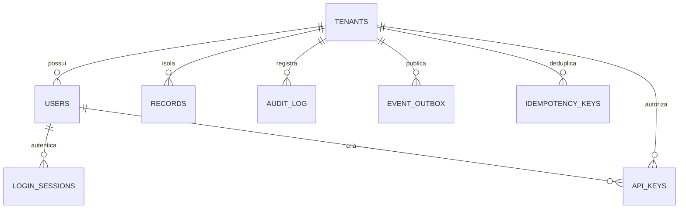

# Modelo de dados do FAT Tech CRM Pro

Snapshot de 2026-09-11, derivado de `apps/api/fattech/models.py`, `schemas.py`, `services.py`, `security.py`, `main.py`, `migrate.py` e `worker.py`. Este documento separa o esquema físico já declarado de regras e ampliações ainda necessárias. O catálogo HTTP está em [API.md](../apps/api/API.md).

## Convenções

- Identificadores são UUIDs serializados em texto de até 36 caracteres; o servidor gera IDs novos.
- Instantes de infraestrutura usam `datetime` UTC com timezone. Alguns prazos de negócio ainda são strings limitadas, não datas validadas semanticamente.
- Valores monetários são inteiros em centavos de BRL, com mínimo zero e máximo `100_000_000_000`. Não usar ponto flutuante para persistir dinheiro.
- `tenant_id`, `id`, `version`, `created_at` e `updated_at` são propriedade do servidor.
- Exclusão de recurso comercial é lógica (`deleted=true`) e incrementa a versão; registros excluídos somem das consultas comuns.
- Payloads são validados com Pydantic `extra=forbid`. Campos protegidos criados pelo servidor não se tornam campos editáveis.

## Esquema físico

| Tabela | Colunas e finalidade | Restrições declaradas |
|---|---|---|
| `tenants` | `id`, `name`, `slug`, `created_at` | PK `id`; `slug` único |
| `users` | `id`, `tenant_id`, `email`, `name`, `password_hash`, `role`, `active`, `created_at` | FK tenant; índice tenant; e-mail globalmente único |
| `login_sessions` | `token_hash`, `user_id`, `csrf_token`, `expires_at`, `revoked` | PK hash SHA-256 da sessão; FK usuário; índices usuário/expiração |
| `records` | `id`, `tenant_id`, `kind`, `data`, `version`, `deleted`, `created_at`, `updated_at` | FK tenant; índice composto `(tenant_id,kind,deleted)` |
| `audit_log` | `id`, `tenant_id`, `actor_id`, `action`, `resource_id`, `details`, `created_at` | FK e índice tenant; ator pode ser nulo para captação pública |
| `event_outbox` | `id`, `tenant_id`, `event_type`, `payload`, `trace_id`, `hops`, `status`, `attempts`, `available_at`, `locked_until`, `claim_token`, `last_error`, `created_at` | FK/índice tenant; índices status e disponibilidade |
| `idempotency_keys` | `id`, `tenant_id`, `key`, `body_hash`, `response`, `created_at` | FK tenant; unicidade `(tenant_id,key)` |
| `api_keys` | `id`, `tenant_id`, `created_by`, `name`, `key_hash`, `prefix`, `scopes`, `revoked`, `expires_at`, `created_at` | FK tenant/usuário; hash único; índice tenant |
| `rate_limits` | `bucket`, `window`, `count` | PK bucket SHA-256; incremento atômico por janela |
| `schema_migrations` | `version`, `applied_at` | Criada pelo migrador, fora do ORM; PK versão; marca inicial `0001` |

`rate_limits` é global para controlar IP/login/chave antes e depois da autenticação. O bucket não armazena o IP ou e-mail em texto. Sessões e chaves guardam hash do segredo; o token de API bruto só é devolvido na criação.

### Consequências da tabela `records`

Os 14 domínios usam uma tabela com discriminador `kind` e objeto JSON `data`. Não existem 14 tabelas comerciais normalizadas. O ORM declara `JSON`; não presumir índices GIN/JSONB nem chaves estrangeiras dentro desse objeto. Tipos e relacionamentos de negócio são validados pelos serviços, enquanto tenant, unicidade técnica e concorrência usam o banco.

Isso permite uma implementação inicial uniforme, mas tem limites: SQL externo pode burlar validações de payload; relação armazenada em JSON não tem FK física; verificar relações antes de commit não impede sozinho uma corrida com exclusão do pai; busca parcial percorre campos JSON sem índice dedicado. Domínios que exigirem fortes invariantes concorrentes, consultas extensas ou relacionamento fiscal devem receber tabelas/constraints/indexação próprios em migrations novas. Não chamar o modelo genérico de ERP completo.

## Dicionário dos recursos

Na resposta HTTP, o serializador expande os campos de `data` no objeto raiz e acrescenta os campos comuns do envelope; não retorna uma chave `data` aninhada. Campos omitidos recebem os defaults definidos no schema; textos e listas têm limites explícitos.

| `kind` | Campos principais | Estados atuais |
|---|---|---|
| `contacts` | nome, e-mail, telefone, empresa textual e `company_id`, origem, tags, score, consentimento, notas, `owner_id` | `new`, `qualified`, `active`, `customer`, `inactive`, `lead` |
| `companies` | nome, site, segmento, e-mail, telefone, documento, notas | `active`, `inactive`, `prospect` |
| `deals` | título, `contact_id`, `company_id`, etapa, `value_cents`, probabilidade, previsão, responsável, notas | `lead`, `qualified`, `proposal`, `negotiation`, `won`, `lost` |
| `tasks` | título, descrição, prioridade, prazo, contato/oportunidade/projeto, responsável | `todo`, `in_progress`, `done`; prioridade `low`, `medium`, `high`, `urgent` |
| `conversations` | título, contato, canal, responsável, última mensagem, `last_inbound_at` | `open`, `pending`, `closed`; canais `internal`, `whatsapp`, `instagram`, `email` |
| `messages` | `conversation_id`, corpo, direção e estado | Criação manual somente `outbound` + `draft` |
| `campaigns` | nome, canal, orçamento, público, data planejada, conteúdo, tags | `draft`, `paused`, `archived`; canais `email`, `whatsapp`, `instagram`, `social`, `ads` |
| `automations` | nome, descrição, gatilho, nós e arestas | `draft`, `paused` |
| `knowledge` | título, conteúdo, categoria, tags, origem | Sem workflow de revisão nesta versão |
| `approvals` | título, gate, descrição, intenção, solicitante, expiração, decisão | Criação `pending`; decisão `approved` ou `rejected`; G1–G6 |
| `agents` | nome, squad, papel, descrição, autonomia, orçamento e gasto | Somente `paused`; A0/A1; gasto inicial zero |
| `projects` | nome, descrição, empresa, responsável, orçamento, prazo, progresso | `planning`, `active`, `paused`, `completed` |
| `invoices` | título, empresa/contato, valor, vencimento, notas | `draft`, `pending`, `paid`, `overdue`, `cancelled` |
| `products` | nome, descrição, SKU, preço, categoria | `active`, `inactive` |

`invoices` são lançamentos internos, não notas fiscais ou transações de um gateway. SKU e documento de empresa não têm unicidade de banco declarada. Empresa textual de contato e `company_id` podem coexistir; sincronização automática entre os dois não está implementada.

## Relações e acesso

`services.RELATIONS` resolve `contact_id→contacts`, `company_id→companies`, `deal_id→deals`, `project_id→projects` e `conversation_id→conversations`. Criação/alteração procura o destino ativo no mesmo tenant e tipo. `owner_id` procura usuário ativo do mesmo tenant. Referência alheia ou ausente não é aceita como vínculo válido. Exclusão verifica vínculos ativos e recusa pai referenciado com 409.

As FKs físicas não incluem tenant composto em cada relação e o modelo de identidade ainda não possui memberships. O escopo confiável é resolvido a partir da sessão/chave e aplicado em query e contexto RLS de transação. A migration força RLS em `records`, `audit_log`, `event_outbox` e `idempotency_keys`; policies usam `tenant_id = NULLIF(current_setting('fattech.tenant_id', true), '')` em leitura e escrita. Runtime não é superusuário/BYPASSRLS, não escreve em `tenants` e não altera/apaga `audit_log`. Isso precisa de prova direta com papel runtime sem privilégios de owner.

Identidade (`users`, `login_sessions`, `api_keys`) não possui RLS nesse schema: autenticação resolve essas tabelas antes do contexto de tenant e as operações dependem de filtros/autorização no código. Não extrapolar a proteção das quatro tabelas acima para afirmar isolamento SQL de toda a plataforma. O migrador ainda usa metadata atual em `create_all` e nomes sem schema explícito: alterações futuras exigem migrações congeladas e qualificadas, não apenas modificar os modelos e manter o marcador `0001`.

O `actor_id` da auditoria não é FK física: permite preservar o identificador histórico do ator. O conteúdo de `details` normalmente guarda versões, nomes de campos e decisões, não senhas ou texto integral de mensagens. O log não possui cadeia criptográfica nem âncora externa; tais requisitos continuam pendentes.

## Invariantes transacionais

1. **Escrita versionada:** update/delete incluem tenant, ID, versão esperada e registro ativo no predicado; `rowcount != 1` retorna conflito. O cliente deve recarregar antes de tentar novamente.
2. **Auditoria/outbox:** `audit_event()` adiciona log e evento à mesma sessão da alteração. O commit do handler confirma o conjunto; falha reverte a sessão. Rate limit confirma seu próprio contador antes da transação de negócio.
3. **Idempotência de webhook:** hash SHA-256 do corpo bruto e resposta original ficam em chave única por tenant. HMAC/timestamp são validados antes do replay. Colisão concorrente usa a restrição única e relê a resposta após rollback.
4. **Aprovação:** intenção é imutável por PATCH, expira após 24 horas, não aceita autoaprovação e exige versão na decisão. Aprovação registra `not_executed`, sem executar a intenção.
5. **Sem envio fictício:** mensagem manual permanece rascunho; endpoint de envio verifica consentimento/janela e retorna indisponível sem adaptador. `last_inbound_at` precisa ser protegido e produzido por integração antes de habilitar envio real.
6. **Sem custo fictício:** cadastro de orçamento não é uma reserva financeira. Execução IA permanece indisponível até existir ledger/reserva/reconciliação compartilhados.

## Outbox e ciclo de processamento

O worker usa estados `pending`, `processing`, `delivered` e `dead_letter`. Claim escolhe evento elegível no tenant, usa `FOR UPDATE SKIP LOCKED` em PostgreSQL e commit antes da rede. Incrementa tentativas, gera token e lease de 90 segundos. O finish altera apenas o registro que ainda possui esse token; falha transitória usa espera exponencial limitada a uma hora, até o limite configurado (default oito tentativas). Falha permanente ou esgotamento fica em `dead_letter`. Evento em `processing` com lease vencido é elegível a novo claim. O schema não impõe enum/check aos status: o contrato está no consumidor e precisa de teste real.

Entrega n8n preserva ID, `trace_id` e incrementa `hops`; usa HMAC sobre timestamp/corpo, sem seguir redirects ou ler corpos de resposta ilimitados. Sem destino configurado, nenhum claim de entrega é feito. Erro de rede é retry com o mesmo `Idempotency-Key`; o receptor precisa deduplicar de forma durável antes de executar efeitos. A tabela não contém ledger da entrega final de WhatsApp/Instagram.

Antes da entrega final de mensagens ou outros efeitos externos, acrescentar estados que distingam falha definitiva de resultado desconhecido. Sem deduplicação durável garantida pelo contrato do destinatário, um timeout após a rede não pode ser transformado em retry automático apenas porque a outbox tem contador. A política deve usar o contrato/idempotência do fornecedor e uma fila de reconciliação.

## Captação pública, origem e privacidade

O formulário exige `consent=true` e grava um contato com `source=website`, metadados UTM e `consented_at`. Não recebe `tenant_id` do visitante. Nome, e-mail e mensagem são dados operacionais privados; não pertencem aos fixtures públicos nem ao inventário de fontes.

Na versão auditada faltam deduplicação transacional por identificador normalizado, registro completo de finalidade/versão de política, histórico de revogação, supressão multicanal, anonimização/exportação e retenção automática. `consent: bool` sozinho não representa todo o histórico de privacidade nem autorização universal de envio. Os CSVs adjacentes e chaves SSH permanecem fora de dados semeados e Git.

## Evolução necessária

| Ampliação | Modelo a acrescentar quando implementada |
|---|---|
| Multiempresas completo | Memberships, unidades, permissão de consolidação, papéis por organização |
| Comercial completo | Pipelines/etapas configuráveis, identificadores únicos normalizados, merge, motivos de perda, propostas e itens |
| Entrega/agenda | Marcos, responsáveis, disponibilidade, reservas com restrição contra conflito, sincronizações externas |
| Atendimento real | Identidade por canal, contas, receipts, mídia privada, opt-out/blocklist e ledger de entrega |
| Jornadas reais | Versão publicada imutável, execuções e passos, espera durável, gatilhos e cooldown |
| IA governada | Provedores, credenciais cifradas, budgets, reservas, custos, turnos e ferramentas autorizadas |
| Conhecimento/RAG | Revisões, anexos, chunks, embeddings, relações, ACL e proveniência por resultado |
| ERP/verticais | Proposta/pedido/itens, razão conciliável ou extensão de frota/OS, sem campos obrigatórios irrelevantes no contato |

Cada ampliação exige migration incremental, rollback/compatibilidade e teste de isolamento/concorrência correspondente. Os 72 grupos funcionais das referências permanecem rastreados mesmo quando não cabem no schema inicial.

## Verificação

Esta documentação foi confrontada com os arquivos de modelo/schema/serviço; não constitui resultado de teste executado. Antes de dados reais: aplicar schema em banco vazio, repetir migration sem perda, testar constraints/RLS com dois tenants, concorrência e rollback, criar/editar/excluir pela API e UI, restaurar dump em banco descartável e registrar o resultado. SQLite não prova comportamento de RLS, JSON e locking de PostgreSQL.
