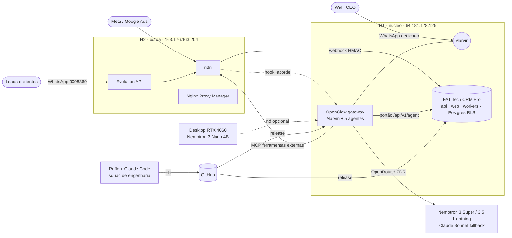
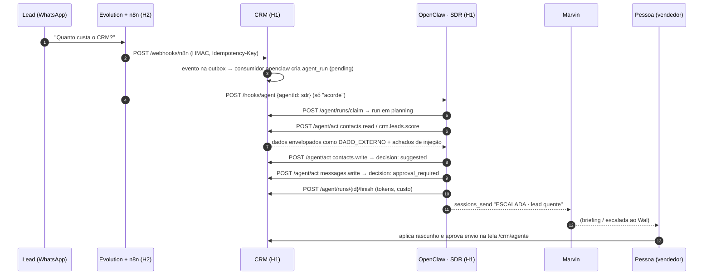

# 01 · Arquitetura

## 1. Contexto (C4 nível 1)

**Tailnet** (Tailscale) liga H1, H2 e o desktop. Nada novo fica exposto na internet: o nginx de
sistema do CRM continua dono de 80/443 no H1; o NPM continua dono de 80/443 no H2.

## 2. Contêineres (C4 nível 2) — host H1

| Contêiner | Projeto Compose | Rede | Publicação | Limites | Estado |
|---|---|---|---|---|---|
| `postgres` | fattechcrmpro | fattechcrmpro-network | nenhuma | 768 MB · 1 CPU | produção |
| `api` (FastAPI) | fattechcrmpro | idem | 127.0.0.1:4321 | 512 MB · 1 CPU | produção |
| `web` (Next.js 16) | fattechcrmpro | idem | 127.0.0.1:4320 | 768 MB · 1 CPU | produção |
| `worker`, `core-worker` | fattechcrmpro | idem | nenhuma | 256 MB · 0,5 CPU cada | produção |
| **`palantyr-openclaw`** | **palantyr-openclaw** | fattechcrmpro-network (externa) + palantyr-network | **127.0.0.1:18789** | **2 GB · 1,5 CPU** | **novo** |
| └ 6× `fattech-crm-mcp` (stdio) | dentro do gateway | — | — | ~50 MB cada | novo |
| └ `palantyr-probe` (stdio) | dentro do gateway | — | — | ~40 MB | novo |

**Orçamento de memória do H1** (4 vCPU · 22 GB, inventário de 15/09):

| | GB |
|---|---|
| Em uso hoje (71 contêineres) | ~18,5 (84%) |
| Liberado por `h1-cleanup-plan.sh` (walchat 2,29 + medify 2,09 + walhospeda 0,09) | −4,5 |
| OpenClaw (teto) | +2,0 |
| **Depois** | **~16 (73%)** |
| Supabase avulso (1,52 GB) — se confirmado resíduo | −1,5 → ~14,5 (66%) |

Sem a limpeza, o OpenClaw entraria num host a 84% com medify consumindo 19,6% de CPU contínuos.
**A limpeza é pré-requisito, não otimização** (ver `08-roadmap.md`, Onda 0).

## 3. O ciclo de uma corrida de agente (sequência)

Propriedades que o desenho garante — e o teste que prova cada uma:

| Propriedade | Como | Prova |
|---|---|---|
| Mesmo evento nunca gera duas corridas | `UNIQUE (tenant_id, trigger_event_id)` | E1/E4 no CRM |
| Recusa não vira laço de retentativa | `/act` devolve 200 com `decision`; a ponte não repete POST | `server.test.mjs` "sem retentativa em POST" |
| Agente não opera como outro | `agent_id` vem do ambiente, nunca de argumento; `tools.deny` das outras pontes | `server.test.mjs` + `openclaw.json5` |
| Agente não sai pelas rotas comuns | `security.py`: chave de agente só entra em `/api/v1/agent/*` | E2 no CRM |
| Nada sai da máquina sem pessoa | `external_sends_enabled=false` + `messages.write` irreversível → aprovação | E2/E5 |
| Gateway fora do ar não perde trabalho | o agente puxa; corridas ficam `pending` | E4 (`agent_dispatch.py`) |

## 4. Os outros três fluxos

**Briefing (Marvin, 08h/12h/18h):** automação → Marvin abre corrida `ciclo-briefing-…` → lê
dashboard, radar, fila de leads, filas e orçamentos do squad, sonda de saúde → escreve o briefing →
entrega no WhatsApp do Wal → encerra a corrida com custo.

**Incidente (Sentinela):** ronda → `probe_verificar` falha 2× → corrida `incidente-…` → tarefa
`eng:ruflo` no CRM com evidência → `sessions_send` ao Marvin → Marvin escala ao Wal (S1/S2).

**Engenharia (Ruflo):** tarefa `eng:ruflo` priorizada pelo Wal → swarm Ruflo no desktop (SPARC,
worktree isolado) → PR → gates (testes, `security scan`, `mcp-scan`, `adr-review`) → merge →
release humana (`install-release.sh` no CRM; `bootstrap-h1.sh` no Palantyr).

## 5. Onde cada coisa guarda estado

| Estado | Onde | Backup |
|---|---|---|
| Clientes, leads, contratos, corridas e passos dos agentes, trilha selada | Postgres do CRM | diário, restauração verificada (já existe) |
| Sessões, automações, credencial do WhatsApp do Marvin | volume `palantyr-openclaw-state` | `09-runbooks.md` RB-06 (tar diário cifrado) |
| Memória de trabalho dos agentes (`memory/`, `MEMORY.md`) | `/opt/palantyr/runtime/workspaces` | idem |
| Contratos dos agentes, config, código | Git (`palantyr-v5`) | GitHub |
| Segredos | Doppler (`palantyr/prd_h1`) | Doppler |
| Conhecimento canônico (CÓRTEX / PALANTYR_BRAIN) | Git → `/opt/palantyr/brain` (só leitura) | GitHub |
