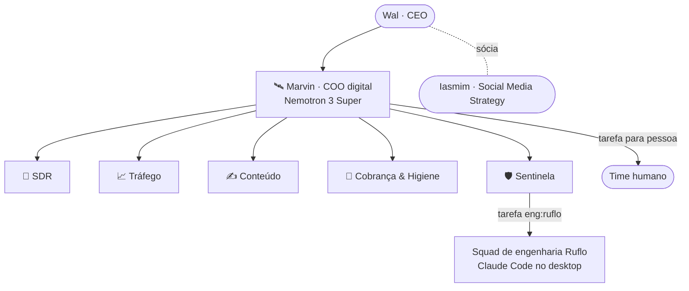

# 03 · Agentes — elenco, mandatos e controles

Fonte única: [`agents/roster.json`](../agents/roster.json). Contrato de cada um: `agents/<id>/AGENTS.md`.

## Organograma

## Matriz de controle

| Agente | Modo inicial | Ferramentas CRM | Gatilhos | Orçamento/mês | Ações/h | Aprovação obrigatória |
|---|---|---|---|---|---|---|
| Marvin | sugestão | 16 (leitura ampla + `tasks.write`) | ciclos + heartbeat | R$ 60 | 60 | — |
| SDR | sugestão | 12 | `contacts.created`, `messages.received`, `contacts.qualification_pending` | R$ 40 | 120 | `messages.write` |
| Tráfego | sugestão | 7 | ciclos 09h/15h + hook de anomalia | R$ 30 | 60 | — |
| Conteúdo | sugestão | 8 | `content_ideas.created` | R$ 30 | 60 | — |
| Cobrança | sugestão | 9 | ciclos 09h15/14h15 | R$ 20 | 60 | — |
| Sentinela | sugestão | 4 | rondas de 15 min | R$ 8 | 30 | — |

Todos **nascem pausados**. `status: active` exige gatilho declarado; qualquer modo acima de
`sugestao` exige orçamento **e** teto de ações declarados — zero significa "ninguém declarou" e o
portão recusa executar (regra `fattech:lead:explicado-vs-zero` do CRM).

**[A CONFIRMAR antes de ativar]:** os nomes exatos de evento em `triggers` contra
`GET /api/v1/core/contract` — o provisionamento recusa ferramenta fora do catálogo, mas não sabe
recusar gatilho que nenhum evento emite.

## Escada de autonomia (quem sobe é o Wal, um agente por vez)

| Degrau | Modo | O que muda | Critério para subir |
|---|---|---|---|
| 0 | pausado | nada roda | provisionado e revisado |
| 1 | `sugestao` | escrita vira rascunho; pessoa aplica | 2 semanas com taxa de rascunho aplicado ≥ 70% e zero incidente |
| 2 | `execucao_interna` (E3) | cria/move/qualifica dentro do CRM | 4 semanas no degrau 1 + E3 entregue com testes |
| 3 | `execucao_externa` (E5) | envio a terceiro, sob compliance no instante do envio | WhatsApp oficial (D-03) + E5 + decisão de negócio registrada |

O Marvin **nunca** sobe o próprio degrau nem o de outro agente.

## Isolamento entre agentes (defesa em profundidade)

1. **Identidade própria no CRM** — uma chave por agente, escopos derivados das ferramentas dele.
2. **Ponte MCP própria** — `crm-<agente>`, com a chave dele no ambiente do processo.
3. **`tools.deny`** — cada agente nega as pontes dos outros (`crm-sdr__*`…) e as ferramentas de
   runtime (`exec`, `process`, `apply_patch`, `browser`); só o Marvin tem `message`.
4. **`subagents.allowAgents`** — só o Marvin delega; o squad tem lista vazia.
5. **`agent_id` fixo no processo** — nenhuma ferramenta aceita `agent_id` de operação como argumento.

## RACI das demandas recorrentes

| Demanda | Marvin | SDR | Tráfego | Conteúdo | Cobrança | Sentinela | Pessoa |
|---|---|---|---|---|---|---|---|
| Responder lead novo | A | R | — | — | — | — | aprova e envia |
| Recomendar ajuste em Ads | A | — | R | — | — | — | Wal decide |
| Post / roteiro / pauta | A | — | — | R | — | — | revisa e publica |
| Follow-up de oportunidade parada | A | C | — | — | R | — | executa |
| Cobrança 1º lembrete | I | — | — | — | R | — | aprova |
| Cobrança formal | I | — | — | — | C | — | **R/A** |
| Incidente de infra | A | — | — | — | — | R | engenharia corrige |
| Briefing ao Wal | **R/A** | C | C | C | C | C | — |

R = executa · A = responde pelo resultado · C = consultado · I = informado
