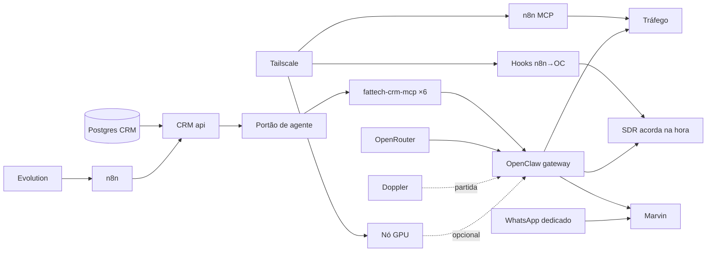

# 07 · Dependências

## Versões fixadas

| Componente | Versão | Onde está fixada | Verificado em |
|---|---|---|---|
| OpenClaw (imagem e CLI) | **2026.9.6** | `compose.yml` (`ghcr.io/openclaw/openclaw:2026.9.6`) | `openclaw config validate` + `doctor --lint` + `mcp probe` (27/09) |
| Node.js (gateway e ponte MCP) | 24.x (`>=24.16`) | imagem oficial; build com `node:24-alpine` | testes da ponte em 24.21.0 |
| `@modelcontextprotocol/sdk` | **1.30.1** | `services/fattech-crm-mcp/package.json` (exato) | 20 testes |
| `zod` | 4.6.5 | idem | idem |
| TypeScript | 7.0.2 (dev) | idem | build limpo |
| Ruflo | 3.46.1 (Palantyr) · 3.41.2 (CRM) | `.local/tooling` | DT-05 |
| FAT Tech CRM Pro | 0.7.0 no código; 0.5.1 na produção consultada em 27/09 | repositório Fattech-CRM | estágios E1, E2, E4; publicação pendente |
| Postgres (CRM) | 17-alpine | compose do CRM | — |
| Ollama + `nemotron-3-nano:4b` | atual | desktop | [A CONFIRMAR] |
| Tailscale | atual | hosts + desktop | — |

## Serviços externos

| Serviço | Para quê | Se cair | Mitigação |
|---|---|---|---|
| OpenRouter | inferência T2/T3 | agentes sem modelo | corridas ficam `pending` (o agente puxa); T1 local cobre classificação; `degraded` na corrida |
| Provedores roteados (DeepInfra, DekaLLM…) | inferência Nemotron | idem | `sort: price` + fallback para outro provedor ZDR; depois Sonnet |
| Anthropic (via OpenRouter) | fallback | só perde o fallback | — |
| Doppler | segredos | não sobe gateway novo | `openclaw.env` já materializado continua valendo |
| Tailscale | acesso remoto e borda↔núcleo | hooks do n8n e nó GPU param | cron de segurança do SDR (30 min) segura a fila |
| Meta WhatsApp (Baileys) | canal do Marvin | Wal sem briefing no zap | painel do OpenClaw pela tailnet; Telegram como plano B |
| GitHub | código e release | sem deploy novo | produção segue; nada depende do GitHub em runtime |

## Grafo de dependência (o que quebra o quê)

**Caminho crítico do negócio:** Postgres → API → portão → ponte MCP → gateway → modelo.
Qualquer elo fora do ar deixa as corridas em `pending` — **atrasa, não perde**. É a propriedade
mais importante da arquitetura e vem de o agente puxar em vez de o CRM empurrar.

## O grafo completo

`graph/graph.json` modela 60+ nós (hosts, serviços, agentes, clientes, modelos, riscos, dívidas,
demandas) e as arestas entre eles, com tipo e peso. É a base do mapa interativo publicado junto
com este projeto. `node graph/build.mjs` regenera o Mermaid e as métricas de centralidade.
