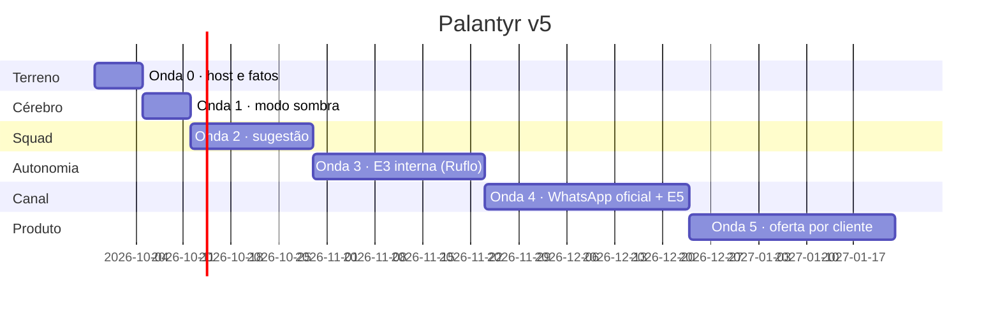

# 08 · Roadmap — do conceito ao executável

Cada onda termina num **critério verificável**, não numa data. Onda sem critério cumprido não
fecha, e a seguinte não começa.

## Onda 0 — Terreno (≈ 1 semana)
**Objetivo:** host com folga e fatos confirmados.
- `h1-host-audit.sh` no H1 → responder todas as marcas [A CONFIRMAR] de host
- `h1-cleanup-plan.sh` (dry-run → revisão → `--execute`) para walchat, medify, walhospeda
- decidir o destino do Supabase avulso (DT-02)
- Tailscale nos dois hosts e no desktop; aplicar `policy.hujson`
- Doppler `palantyr/prd_h1` criado
- **Critério:** memória do H1 ≤ 75%; portas 18789/8443 livres; os `tests` da ACL passam.

## Onda 1 — Cérebro no ar em modo sombra (≈ 1 semana)
**Objetivo:** gateway rodando, agentes pausados, modelos medidos.
- `openclaw models list --provider openrouter` → confirmar IDs e suporte a ferramentas (DT-12)
- `evals/ptbr` para Super, Lightning, Nano 4B e Sonnet → escolher modelo por papel (DT-13)
- `provision-crm-agents.py --dry-run` → revisão → provisionar (todos pausados)
- conferir gatilhos contra `GET /api/v1/core/contract` (DT-14)
- `bootstrap-h1.sh` → gateway saudável, `doctor` limpo, `mcp probe` 6×8 + 2
- parear WhatsApp dedicado do Marvin; `automations.sh`
- **Critério:** 5 dias úteis de briefings 08h/12h/18h entregues, com custo real por ciclo registrado
  em `agent_runs`.

## Onda 2 — Squad em sugestão (≈ 2–3 semanas)
**Objetivo:** agentes trabalhando, pessoas aplicando.
- ativar na ordem de valor: **SDR → Cobrança → Tráfego → Conteúdo → Sentinela**, um a cada 2–3 dias
- n8n: workflows de borda como ferramentas MCP (D-07) e hook "lead-in" acordando o SDR
- healthcheck externo do H1 pelo H2 (DT-16)
- **Critério:** taxa de rascunho aplicado ≥ 70% por agente; zero lead quente sem retorno no dia;
  zero incidente de segurança; custo total ≤ US$ 25/mês.

## Onda 3 — Autonomia interna (≈ 3–4 semanas, engenharia Ruflo)
- D-01 (E3 `execucao_interna`), D-02 (reciclagem), D-05 (aidefence), D-06 (testes)
- subir para `execucao_interna`, um agente por vez, pelo critério de `03-agentes.md`
- **Critério:** E3 com testes verdes no CRM; agentes movendo card, qualificando e agendando
  tarefa sem pessoa, com recusas por teto aparecendo como `refused`.

## Onda 4 — Canal oficial e execução externa (depende de contrato com BSP)
- D-03 WhatsApp Cloud API · D-04 E5 `execucao_externa` · D-10 agenda
- **Critério:** mensagem aprovada sai pelo outbox → BSP com compliance avaliado no instante do
  envio; opt-out recusado e auditado; o site deixa de prometer o que não entrega (25 páginas).

## Onda 5 — Produto (o Palantyr vira oferta)
- empacotar "funcionário digital FAT Tech" por cliente: mesmo artefato, topologia por variável de
  ambiente (regra do OPENCLAW_BLUEPRINT §8), orçamento de modelo no preço
- **Critério:** primeiro cliente do Ecossistema CRM com SDR IA em sugestão, custo de modelo por
  cliente medido e abaixo de 10% do ticket mensal.

## Linha do tempo

